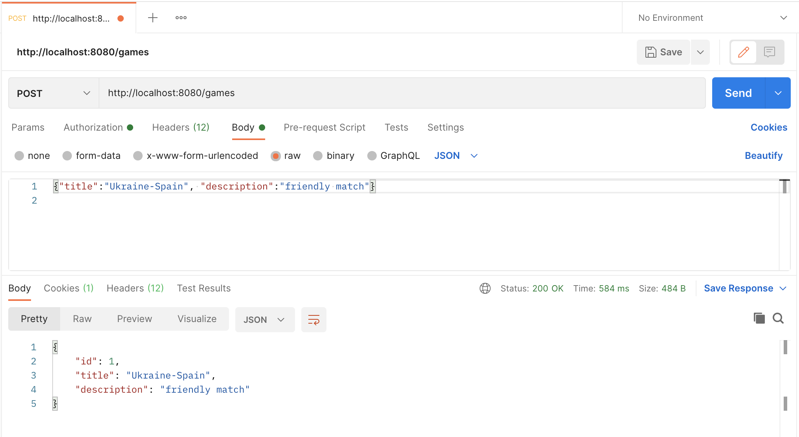

# football-tickets-app

### Table of contents
~~~~
1.About The Project
2.Built With
3.Getting Started
4.Project Improvement
~~~~

#### 1.About The Project
This project is about work of football tickets service. Login and logout done with Spring Security. 

App has two roles : user and admin. Admin can add new game, new stadium to database, 
add, update or delete match. To do GET/POST/PUT/DELETE requests you may use Postman with Basic Authentication.

User can move to his shopping cart, add ticket to cart, complete order, 
display order history, display all games and available matches. 
To do GET/POST-requests you may use Postman.

From the technical point of view it is 3-tier architecture Spring WEB-project with Database connection.
~~~~
- Controller-layer: processing requests from the user/admin and generating a response
- Service-layer: business logic of football tickets service work, authentication
- DAO-layer: realization of CRUD-methods, custom methods
- Custom email and password validation.
- Custom Global Exception Handler
- Using Dto-pattern
~~~~

#### 2.Built With
~~~~
- Maven
- Tomcat
- MySQL
- Postman
~~~~
Technologies used:
~~~~
- Hibernate
- Spring WEB
- Spring Security
- Logger
- Lombok
- HTML/CSS  
- REST
- S.O.L.I.D
- OOP principles 
~~~~

#### 3.Getting Started
### Installation
~~~~
1. Clone the repo
2. Open scr/main/java/spring/web/resources/db.properties and enter all necessary data
3. Build project use command: mvn compile
4. Run Tomcat configuration
~~~~

#### 4.Project Improvement
##### Ways to improve project:
-> Finish the design and configuration of the menu for the rest Controllers.

-> Create test classes and unit tests for checking the work of each service to cover code lines at least on 80%.

   
